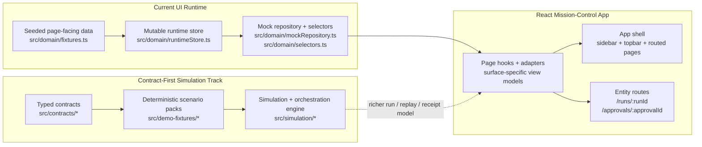
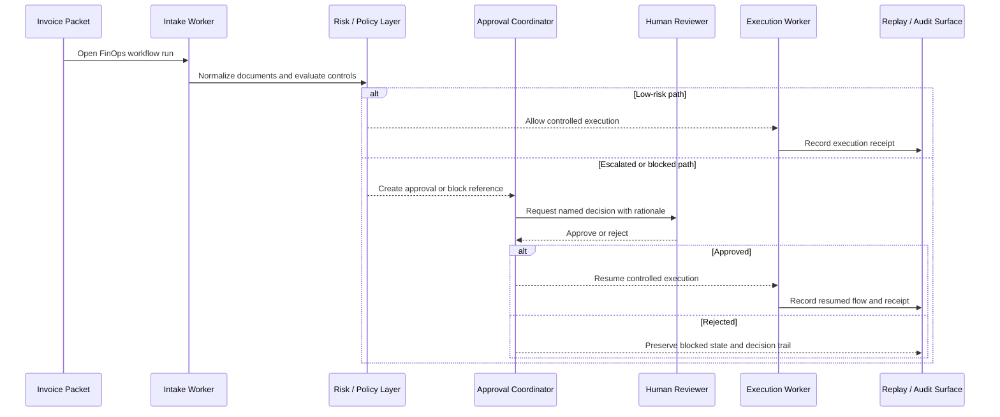

# Aegis

> A digital labor control tower for enterprise AI workers.

Aegis is a mission-control product for supervising AI workers on high-stakes business workflows. It is built around one core idea: AI work should be visible, governed, and replayable before it is trusted with execution.

The first showcase domain is FinOps and back-office operations. The current product demonstrates how AI workers can intake invoice packets, detect mismatches, surface risk, pause for human approval, and leave behind an auditable trail of what happened and why.

## Table of Contents

- [What Aegis Is](#what-aegis-is)
- [Current Product Surface](#current-product-surface)
- [The Story The Product Tells](#the-story-the-product-tells)
- [Architecture Overview](#architecture-overview)
- [Codebase Map](#codebase-map)
- [Current Scenario Coverage](#current-scenario-coverage)
- [Route Inventory](#route-inventory)
- [Local Development](#local-development)
- [Implementation Status](#implementation-status)
- [Source Of Truth](#source-of-truth)

## What Aegis Is

Aegis is not:

- a generic chatbot
- a thin workflow assistant
- a finance dashboard with AI branding
- an opaque agent demo where important decisions disappear behind "automation"

Aegis is:

- a control plane for AI workers
- a product that makes worker activity legible
- a system that gates risky actions behind policy and approval
- a replayable record of what was attempted, blocked, escalated, approved, and executed

The product posture is simple:

- low-risk work should move cleanly
- risky work should pause explicitly
- humans should see what they are authorizing
- every important step should have context, evidence, and a visible trail

## Current Product Surface

The repo is no longer at the "planning only" stage. The current implementation already includes a routed React application, a reusable shell, seeded workflow scenarios, entity detail routes, mutable runtime state, and a newer contract-first simulation stack that is landing alongside the existing page-facing runtime.

Today the app contains:

- a mission-control shell with sectioned navigation and global operational context
- an overview page focused on active runs, approvals, worker posture, and a scenario spotlight
- dedicated pages for Agents, Runs, Approvals, Replay & Audit, Policies, FinOps Workflow, and Settings & Demo Controls
- first-class entity routes for run details and approval details
- seeded runtime state that can be mutated from the UI to drive believable progression
- a domain selector and page-adapter layer that converts seeded state into product-facing cards, queues, timelines, and detail views
- a newer contracts, fixtures, and simulation layer that models workers, orchestration, permissions, decisions, replay frames, and execution receipts in more depth

## The Story The Product Tells

Every meaningful implementation in Aegis should strengthen this narrative:

1. an AI worker begins a workflow
2. the system shows what the worker is doing
3. low-risk work proceeds without drama
4. a risky step is detected
5. policy and risk explain the issue
6. the workflow is gated, blocked, or escalated
7. a human reviewer can authorize or reject the next action
8. the product records the full chain of events
9. the run can be replayed afterward

That narrative already shows up in the seeded FinOps paths across the current routes.

## Architecture Overview

### High-Level Product Architecture



### How Risky Workflow Progression Is Modeled



### Practical Architecture Notes

There are two closely related implementation layers in the repo right now:

1. The current routed UI is driven by the page-facing domain runtime in [`src/domain`](./src/domain), plus [`src/app/data`](./src/app/data) adapters that shape state into mission-control views.
2. A more explicit contract-first system exists in [`src/contracts`](./src/contracts), [`src/demo-fixtures`](./src/demo-fixtures), and [`src/simulation`](./src/simulation). It models richer worker orchestration, stage history, handoffs, permission evaluation, decisions, replay frames, and execution receipts.

This is intentional progress, not accidental duplication. The product already has a usable demo surface, and the repo now also contains the stronger underlying contract and simulation backbone that future wiring can converge on.

## Codebase Map

| Area | Purpose |
| --- | --- |
| [`src/app`](./src/app) | Router, route metadata, entity route helpers, and page data hooks/adapters. |
| [`src/components/shell`](./src/components/shell) | Shared app shell, sidebar, page frame, cards, and stack-list primitives. |
| [`src/pages`](./src/pages) | Product surfaces for overview, runs, approvals, policies, replay, FinOps, settings, and entity detail pages. |
| [`src/domain`](./src/domain) | Current page-facing seeded contracts, fixtures, selectors, repository helpers, and mutable runtime state used by the UI. |
| [`src/contracts`](./src/contracts) | Newer canonical contracts for actions, workers, permissions, audit, decisions, and demo scenario types. |
| [`src/demo-fixtures`](./src/demo-fixtures) | Deterministic worker registry, scenario catalog, business artifacts, and scenario packs for richer simulation paths. |
| [`src/simulation`](./src/simulation) | Orchestration, transitions, permission logic, risk scoring, decision building, and simulated run generation. |
| [`PLAN.md`](./PLAN.md) | Product capability map and wave breakdown. |
| [`AGENTS.md`](./AGENTS.md) | Repository operating rules, architecture guardrails, and execution expectations for coding agents. |

## Current Scenario Coverage

The repo currently contains two useful layers of seeded workflow coverage.

### Routed UI Seed State

The current UI runtime exposes five seeded scenarios through the page-facing domain fixtures:

- `scenario-northwind-mismatch` - three-way mismatch hold
- `scenario-aperture-bank-drift` - vendor remittance drift review
- `scenario-helios-clean-posting` - clean invoice ready for controlled posting
- `scenario-beacon-accrual-exception` - freight accrual evidence gap
- `scenario-atlas-safe-match` - trusted supplier auto-match

These scenarios power the existing mission-control, runs, approvals, and detail-route experiences.

### Expanded Contract-First Scenario Catalog

The newer demo-fixture catalog currently defines six FinOps scenario packs:

| Scenario key | Risk posture | Intended outcome |
| --- | --- | --- |
| `safe-invoice-trusted-vendor` | low | autonomous progression under control |
| `unknown-vendor-escalation` | high | escalate before vendor onboarding |
| `invoice-po-mismatch` | high | review due to PO variance |
| `vendor-bank-change-hold` | high / critical posture in fixture copy | explicit payment hold |
| `missing-documentation-block` | high | block on compliance documentation gap |
| `threshold-exceeded-review` | medium | require named reviewer over release threshold |

That catalog is where the richer, deterministic simulation story is being codified.

## Route Inventory

| Route | Purpose |
| --- | --- |
| `/` | Mission Control overview for runs, approvals, posture, worker activity, and spotlighted scenarios. |
| `/agents` | Worker roles, assignments, runtime posture, and handoff-oriented summaries. |
| `/runs` | Run queue, step progression, orchestration framing, and run posture. |
| `/runs/:runId` | Entity detail route for a specific run, including mutable run and step controls. |
| `/approvals` | Pending approvals, urgency, protected value, and intervention queue framing. |
| `/approvals/:approvalId` | Entity detail route for approval state mutation, linked run posture, and decision context. |
| `/replay` | Replay and audit-facing surface for execution history and evidence framing. |
| `/policies` | Policy posture, allow/escalate/block framing, and risk controls. |
| `/finops` | First showcase domain surface for high-stakes back-office workflow context. |
| `/settings` | Narrow demo-safe environment and scenario-control surface. |

## Local Development

### Prerequisites

- Node.js 18+ recommended
- npm

### Install

```bash
npm install
```

### Start The App

```bash
npm run dev
```

Vite will start the local development server and serve the React app.

### Validate The Repo

```bash
npm run build
```

The build command runs:

- `tsc --noEmit`
- `tsc --project tsconfig.node.json --noEmit`
- `vite build`

There is currently no dedicated test script in `package.json`; the build is the main validation path available in-repo today.

## Implementation Status

| Capability | Status | Notes |
| --- | --- | --- |
| Mission-control shell and shared UI system | Implemented | Routed shell, sidebar, topbar, shared cards, and product-wide layout primitives are in place. |
| Core routed product surfaces | Implemented | Overview, Agents, Runs, Approvals, Replay, Policies, FinOps, and Settings all exist. |
| Entity detail routes | Implemented | Run and approval detail routes are parameterized and connected to mutable shared state. |
| Seeded scenario-driven demo | Implemented | The current UI is powered by deterministic seeded fixtures in `src/domain/fixtures.ts`. |
| Runtime mutation for believable progression | Implemented | Run, step, approval, and scenario state can be patched through the central runtime store. |
| Contract-first orchestration model | Implemented in repo, not fully wired everywhere | `src/contracts`, `src/demo-fixtures`, and `src/simulation` model richer orchestration, permissions, replay frames, and receipts. |
| Real backend integrations and live tool execution | Not implemented | The product remains demo-safe and deterministic by design. |

## Source Of Truth

If you are working in this repository, start with these files:

- [`PLAN.md`](./PLAN.md) for product direction and wave boundaries
- [`AGENTS.md`](./AGENTS.md) for implementation rules and architecture guardrails
- [`src/app/routes.tsx`](./src/app/routes.tsx) for route structure
- [`src/domain/runtimeStore.ts`](./src/domain/runtimeStore.ts) for the current UI state backbone
- [`src/contracts`](./src/contracts) and [`src/simulation`](./src/simulation) for the newer contract and orchestration model

In short:

- `PLAN.md` explains what Aegis is supposed to become
- the existing app shows what is already real
- the contracts and simulation layers show where the architecture is becoming more explicit
